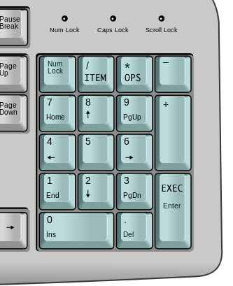

# shuttle-command
Use a modified numpad to emulate the input of commands in a space shuttle.

# Set-up
You need an (external) numpad and modify it to look like this image:

download the [shuttle.sh](shuttle.sh) script using your preferred method

# Usage
open the script in terminal, enter the correct position and then the correct operation.

Then you can enter the item-code, which will display whether it was correct or not.

To exit from a position, enter operation 999.

# Demo

# License

Made for JWR v.z.w by Haroen Viaene