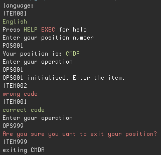

# shuttle-command
Use a modified numpad to emulate the input of commands in a space shuttle.

# Set-up
You need an (external) numpad and modify it to look like this image:


The keypad is modified to show:

| original     | replaced |
| ------------ | -------- |
| <kbd>+</kbd> | HELP     |
| <kbd>-</kbd> | POS      |
| <kbd>/</kbd> | ITEM     |
| <kbd>*</kbd> | OPS      |

You'll also need a bash shell (included in most Linux distributions and in Mac OS X, emulators can be found for Windows)

## Downloading the script

Download the [shuttle.sh](img/shuttle.sh) script using your preferred method. For example through git:

```sh
git clone https://github.com/haroenv/shuttle-command.git
cd shuttle-command
ls
```

The advantage of using git instead of just downloading the files using curl, or the github zip download feature is that you can update the script when necessary using `git pull

or if you don't have git, a simple curl should also work:

```sh
curl https://github.com/Haroenv/shuttle-command/archive/master.zip
unzip master.zip
cd shuttle-command
ls
```

## Changing the keymap

To use this method, you'll have to find out to what keys your numpad are mapped. When you find out what keycodes the keys to replaced are mapped, you can change your keymap to.

| original     | replaced |
| ------------ | -------- |
| <kbd>+</kbd> | HELP     |
| <kbd>-</kbd> | POS      |
| <kbd>/</kbd> | ITEM     |
| <kbd>*</kbd> | OPS      |

- [ ] to do: how to change keymap

When using the script, your "input method" will be "ITEM001"

## Using the delayed input

Using this method, you don't have to change anything to your terminal or install to your machine. The drawback is that you can't see your input until pressing <kbd>EXEC</kbd>(<kbd>⏎</kbd>/<kbd>ENTER</kbd>). This is because it has to be processed before being able to show what the several keys mean.

When using the script, your "input method" will be "ITEM002"

## Using the modified font (not recommended)

Download the [font](font.otf) and install it (usually: `sudo cp -r ./font.otf /usr/share/fonts/truetype/`) or installing it using the default graphical method.

To make things easy, the first method is also included in a script called `moveFont.sh`, which can ask for your admin password.

and make sure it is used in your terminal (right-click > preferences > font > For Personal Gain (regular)).

This font is modified to show:

| original     | replaced |
| ------------ | -------- |
| <kbd>+</kbd> | HELP     |
| <kbd>-</kbd> | POS      |
| <kbd>/</kbd> | ITEM     |
| <kbd>*</kbd> | OPS      |

Now you can enter as expected on the numpad, but a drawback is that it's harder to read due to its lower size, and it changes settings for the whole terminal

When using the script, your "input method" will be "ITEM001"

# Usage

Open your terminal, `cd` into the correct directory.

It could be possible that the script doesn't have the correct permissions. You can check this by doing `ls -l shuttle.sh` in the correct directory. The output should look like this: `-rwxr-xr-x 1 user  staff   6.7K Mar 18 12:06 shuttle.sh*`, important is that you at least see the first `x`, if you don't you can change the permissions using `chmod 755 shuttle.sh`.

## Running

open the script in terminal using `./shuttle.sh`, enter the language, the correct position and then the correct operation.

Then you can enter the item-code, which will display whether it was correct or not.

To exit from a position, enter operation 999.


## Operating

- [ ] to do: remake the scripts to make use of `shuttle.sh`
- [ ] to do: make `shuttle.sh` in such a way that it matches the script

The times at which certain codes have to be entered are written in the space shuttle script. This can be found at [scripts/](scripts/)

# Demo
## Methods one and two
This is also the preferred method for a full keyboard without alterations. AutoKey will convert the keys on the keypad to the corresponding codes when correctly set up.



## Method three
This method is optimised for input by numpad, but not great when you want to still do other things in the same window.


# License
[](http://creativecommons.org/licenses/by-sa/4.0/)

shuttle-command is licensed under a [Creative Commons Attribution-ShareAlike 4.0 International License](http://creativecommons.org/licenses/by-sa/4.0/). No warranty whatsoever.

Made for [JWR v.z.w](http://jwronline.be) by Haroen Viaene


Font is based on ["For Personal Gain - NonProfit"](https://medium.com/portfolio-process/why-im-giving-my-typeface-away-for-free-466919f02d96) (CC 0)