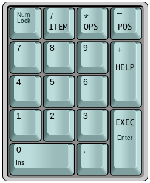
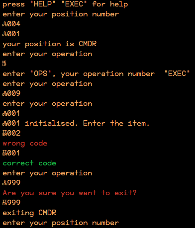

# shuttle-command
Use a modified numpad to emulate the input of commands in a space shuttle.

# Set-up
You need an (external) numpad and modify it to look like this image:

## Using the modified font

Download the [shuttle.sh](img/shuttle.sh) script using your preferred method

Download the [font](shuttle.otf) and install it (usually: `sudo cp -r ./shuttle.otf /usr/share/fonts/truetype/`)

and make sure it is used in your terminal (right-click > preferences > font > For Personal Gain (regular)). This font is modified to show <kbd>+</kbd> as <kbd>HELP</kbd>, <kbd>-</kbd> as <kbd>POS</kbd>, <kbd>*</kbd> as <kbd>OPS</kbd> and <kbd>/</kbd> as <kbd>ITEM</kbd>.

## Using AutoKey

- [ ] to do: write documentation

# Usage
open the script in terminal, enter the correct position and then the correct operation.

Then you can enter the item-code, which will display whether it was correct or not.

To exit from a position, enter operation 999.

# Demo

# License
 shuttle-command is licensed under a <a rel="license" href="http://creativecommons.org/licenses/by-nc/4.0/">Creative Commons Attribution-NonCommercial 4.0 International License</a>. No warranty whatsoever.

Made for [JWR v.z.w](http://jwronline.be) by Haroen Viaene

Font is based on ["For Personal Gain - NonProfit"](https://medium.com/portfolio-process/why-im-giving-my-typeface-away-for-free-466919f02d96)
